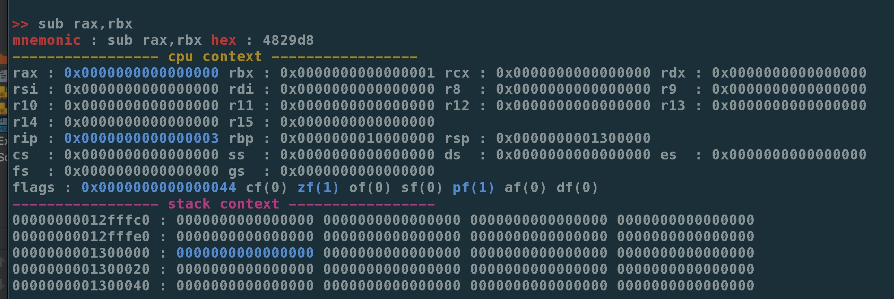

# Overview

this project is inspired by https://github.com/poppycompass/asmshell

## Preview



## Usage
```
shell> asm-cli-rust [x86/x64]

default : x64
optional: x86
```

key_up/key_down: history

## Build from source

1. `cargo b`

## Go version

https://github.com/cch123/asm-cli
